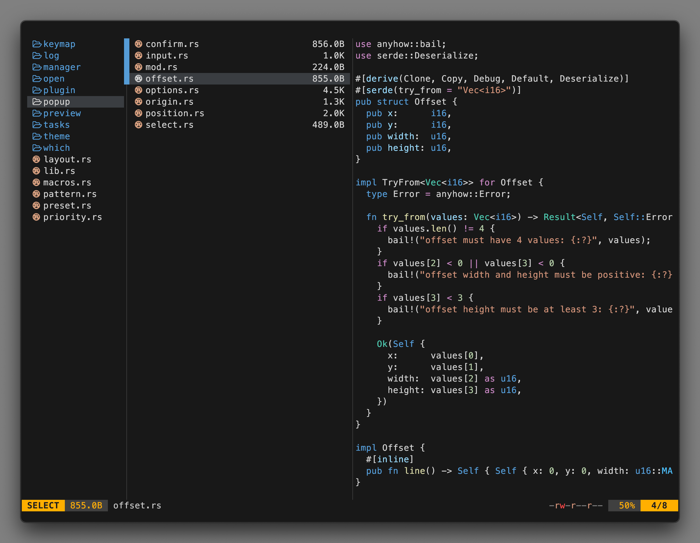

<div align="center">

<h3>
	VSCode Dark Plus Flavor for <a href="https://github.com/sxyazi/yazi">Yazi</a>
</h3>
<a>
	This <a href="https://github.com/sxyazi/yazi">Yazi</a>  flavor matches the <a href="https://code.visualstudio.com/">Visual Studio Code</a> default theme.
</a>
</div>

## 👀 Preview



## 🎨 Installation

### Yazi CLI

```bash
# v25.5.28+
ya pkg add 956MB/vscode-dark-plus

# pre v25.5.28 (deprecated)
ya pack -a 956MB/vscode-dark-plus
```

### Manual

```bash
# Linux/macOS
git clone https://github.com/956MB/vscode-dark-plus.yazi.git ~/.config/yazi/flavors/vscode-dark-plus.yazi

# Windows
git clone https://github.com/956MB/vscode-dark-plus.yazi.git %AppData%\yazi\config\flavors\vscode-dark-plus.yazi
```

## ⚙️ Usage

Add the these lines to your `theme.toml` configuration file to use it:

```toml
[flavor]
dark = "vscode-dark-plus"
```

## 📜 License

The flavor is MIT-licensed, and the included tmTheme is also MIT-licensed.

Check the [LICENSE](LICENSE) and [LICENSE-tmtheme](LICENSE-tmtheme) file for more details.
